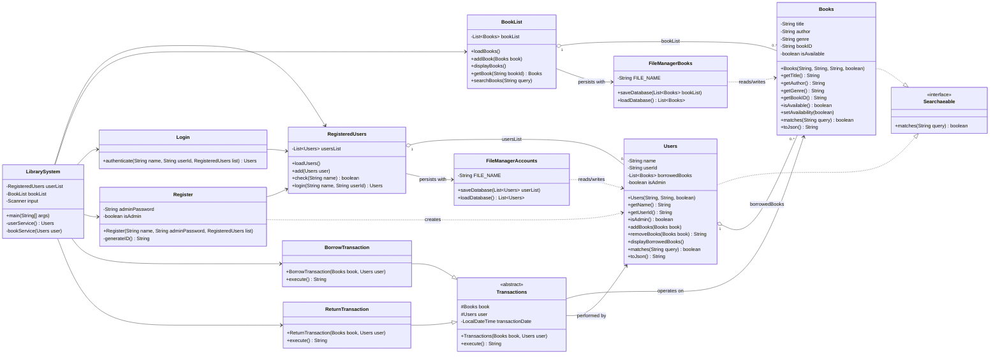

# Adaptive Library System

```mermaid
classDiagram
    direction LR

    class LibrarySystem {
        -RegisteredUsers userList
        -BookList bookList
        -Scanner input
        +main(String[] args)
        -userService() Users
        -bookService(Users user)
    }

    class Searchaeable {
        <<interface>>
        +matches(String query) boolean
    }

    class Books {
        -String title
        -String author
        -String genre
        -String bookID
        -boolean isAvailable
        +Books(String, String, String, boolean)
        +getTitle() String
        +getAuthor() String
        +getGenre() String
        +getBookID() String
        +isAvailable() boolean
        +setAvailability(boolean)
        +matches(String query) boolean
        +toJson() String
    }

    class Users {
        -String name
        -String userId
        -List~Books~ borrowedBooks
        -boolean isAdmin
        +Users(String, String, boolean)
        +getName() String
        +getUserId() String
        +isAdmin() boolean
        +addBooks(Books book)
        +removeBooks(Books book) String
        +displayBorrowedBooks()
        +matches(String query) boolean
        +toJson() String
    }

    class RegisteredUsers {
        -List~Users~ usersList
        +loadUsers()
        +add(Users user)
        +check(String name) boolean
        +login(String name, String userId) Users
    }

    class BookList {
        -List~Books~ bookList
        +loadBooks()
        +addBook(Books book)
        +displayBooks()
        +getBook(String bookId) Books
        +searchBooks(String query)
    }

    class Login {
        +authenticate(String name, String userId, RegisteredUsers list) Users
    }

    class Register {
        -String adminPassword
        -boolean isAdmin
        +Register(String name, String adminPassword, RegisteredUsers list)
        -generateID() String
    }

    class Transactions {
        <<abstract>>
        #Books book
        #Users user
        -LocalDateTime transactionDate
        +Transactions(Books book, Users user)
        +execute() String
    }

    class BorrowTransaction {
        +BorrowTransaction(Books book, Users user)
        +execute() String
    }

    class ReturnTransaction {
        +ReturnTransaction(Books book, Users user)
        +execute() String
    }

    class FileManagerAccounts {
        -String FILE_NAME
        +saveDatabase(List~Users~ userList)
        +loadDatabase() List~Users~
    }

    class FileManagerBooks {
        -String FILE_NAME
        +saveDatabase(List~Books~ bookList)
        +loadDatabase() List~Books~
    }

    Books ..|> Searchaeable
    Users ..|> Searchaeable

    BorrowTransaction --|> Transactions
    ReturnTransaction --|> Transactions

    Users "1" o-- "0..*" Books : borrowedBooks
    BookList "1" o-- "0..*" Books : bookList
    RegisteredUsers "1" o-- "0..*" Users : usersList

    Transactions --> Books : operates on
    Transactions --> Users : performed by

    LibrarySystem --> RegisteredUsers
    LibrarySystem --> BookList
    LibrarySystem --> Login
    LibrarySystem --> Register
    LibrarySystem --> BorrowTransaction
    LibrarySystem --> ReturnTransaction

    Login --> RegisteredUsers
    Register --> RegisteredUsers
    Register ..> Users : creates

    RegisteredUsers --> FileManagerAccounts : persists with
    BookList --> FileManagerBooks : persists with
    FileManagerAccounts ..> Users : reads/writes
    FileManagerBooks ..> Books : reads/writes
```
